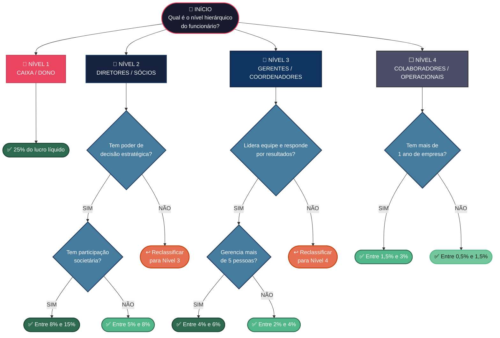

# 💰 Árvore de Decisão — Distribuição de Lucros

> Estrutura para definição da porcentagem do lucro por nível hierárquico.

---

## 🌳 Fluxograma de Decisão

---

## 📊 Tabela Resumo de Distribuição

| Nível | Cargo | % por Pessoa | Critério |
|:-----:|-------|:------------:|---------|
| 🔺 **1** | Caixa / Dono | **25%** | Fixo |
| 🔷 **2** | Diretor / Sócio | **8% – 15%** | Com sociedade |
| 🔷 **2** | Diretor / Sócio | **5% – 8%** | Sem sociedade |
| 🔹 **3** | Gerente / Coordenador | **4% – 6%** | Equipe > 5 pessoas |
| 🔹 **3** | Gerente / Coordenador | **2% – 4%** | Equipe ≤ 5 pessoas |
| ⬜ **4** | Colaborador | **1,5% – 3%** | Mais de 1 ano |
| ⬜ **4** | Colaborador | **0,5% – 1,5%** | Menos de 1 ano |

---

## ⚙️ Regras Gerais

- 📌 A distribuição incide sobre o **lucro líquido** (após impostos e despesas).
- 📌 A soma de todas as porcentagens **não deve ultrapassar 72%** — os 28% restantes ficam como reserva da empresa.
- 📌 Revisão **anual obrigatória** no início de cada exercício.
- 📌 Gatilho mínimo: distribuição só ocorre se o lucro superar o **ponto de equilíbrio**.

---

*Documento interno · Revisão: Mai/2026*
